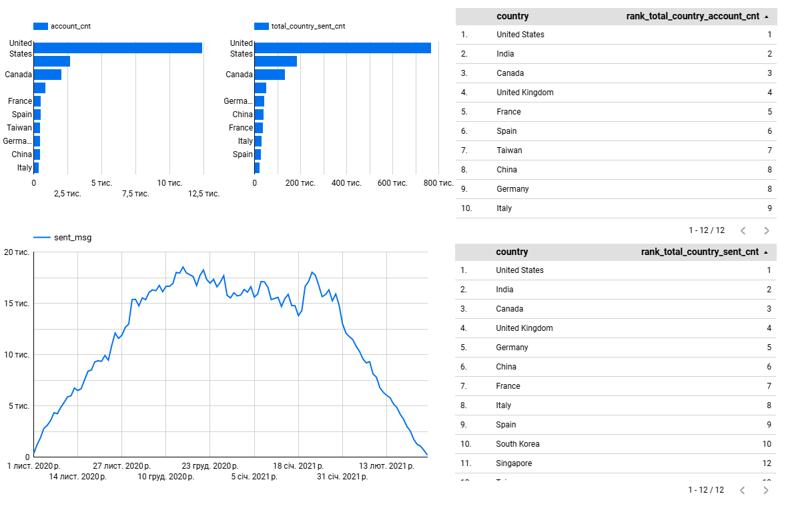

# LettersAnalyticsSQL
LettersAnalyticsSQL - запит для отримання даних, які допоможуть аналізувати динаміку створення акаунтів, активність користувачів за листами (відправлення, відкриття, переходи), а також оцінювати поведінку в категоріях, таких як інтервал відправлення, верифікація акаунтів і статус підписки. Дані дозволять порівнювати активність між країнами, визначати ключові ринки, сегментувати користувачів за різними параметрами.

